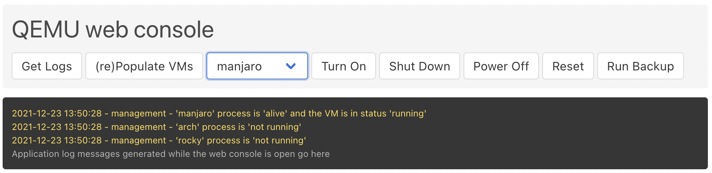

# QEMU Web Console
QEMU Web Console is a Flask web applicaiton, providing basic management capabilities for QEMU VMs:
* Run, Shutdown and Power Off VMs
* Execute full backups

The application was built with 'set it and forget it' attitude, so after the initial installation and config of the required QEMU VMs, there will be minimum to no activities required to start/stop vms, take care for backups, configuration of the host etc. etc.

Console commands can be run both via the web interface (browser), or in a scripted way using e.g. curl. Examples follow below.
Additionally, using the supplied boot-shutdown script and launchd job definition, an automated graceful shutdown and start of the VMs can be defined upon resp. shutdown and startup of the host machine.

The app was developed and tested with Python 3.9 on M1 macOS Monterey. 

## Configuration
Upon cloning this repository, make sure the config.ini reflects your setup. Parameter values are defined instead of the xxx, without use of quotes or any other chars.

```vms = /Volumes/nvme/qemu-vms``` sets the path where the managed QEMU VMs are stored. Every subfolder should match the VM name.

```scripts = /usr/local/bin``` defines the location of the QEMU VM start scripts. See [QEMU run scripts](qemu-run-scripts).

```sockets = /private/tmp``` sets the location of the unix socket files for QMP connection. See [QEMU run scripts](qemu-run-scripts).

```backups = /Volumes/nvme/qemu-backup``` is the default path for backups (if no explicit path requested when running backup). See [Backups](backups).

```os_disk_id = disk``` specifies ID of the vm main disk node (id used in backup operations). See [QEMU run scripts](qemu-run-scripts).

## Building the application
Python's [py2app](https://py2app.readthedocs.io/en/latest/index.html) module can be used to produce a standalone application bundle with all necessary modules and data files. 
Steps to build as standalone application:
1. Create a python virtual environment 
2. Activate the environment and install all required modules using the supplied requirements.txt
3. Run py2app building an app bundle either in alias mode, or for deployment. 
    * Depending on which of these two options was chosen, and should you want to run as a launchd Daemon, please adjust the 
job definition plist accordingly. 
If purposeful, the app can also be run directly from the source files using a python virtual environmnet.

## QEMU run scripts
The application exects the QEMU run scripts to be stored as executable files under the location specified with the *scripts* key of ```config.ini```.

Example run script looks as follows:
```sh
#!/bin/bash
/opt/homebrew/bin/qemu-system-aarch64 \
  -serial none \
  -qmp unix:/tmp/arch.sock,server,nowait \
  -M virt,highmem=off \
  -accel hvf \
  -cpu host \
  -smp 4 \
  -m 4096 \
  -drive file=/Volumes/nvme/qemu-vms/arch/edk2-aarch64-code.fd,if=pflash,format=raw,readonly=on \
  -drive file=/Volumes/nvme/qemu-vms/arch/ovmf_vars.fd,if=pflash,format=raw \
  -device virtio-gpu-pci \
  -vga std \
  -device qemu-xhci \
  -device usb-kbd \
  -device usb-tablet \
  -device intel-hda \
  -device hda-duplex \
  -drive file=/Volumes/nvme/qemu-vms/arch/arch.qcow2,id=disk,if=virtio,cache=writethrough \
  -netdev vmnet-macos,id=n1,mode=bridged,ifname=en0 \
  -device virtio-net,netdev=n1 \
  -display none \
  -name arch \
  -nographic
```

The following elements are important for the operation of the qemu-console:
1. For the run script name, a pattern of ```start-vm-<vm-name>``` should be followed. The *vm-name* part should correspond to the vm folder name within the managed QEMU VMs folder as specified in ```config.ini```
2. The parameter ```-qmp unix:<sockets-location>/<vm-name>.sock,server,nowait``` specifies the location of the unix socket the application uses to communicate with the QEMU process. Following parts should correspond to the configuration set in  ```config.ini```:
    * The *sockets-location* part is the unix socket files location
    * The *vm-name* part is the resp. vm sub-folder name within the managed QEMU VMs folder
3. The parameter ```-drive file=<managed-vms-location>/<vm-name>/<disk-name>.qcow2,id=<disk-identifier>,if=virtio,cache=writethrough``` specifies the virtual disk of the VM. Following parts should correspond to the configuration set in  ```config.ini```:
    * The *managed-vms-location* is the managed QEMU VMs folder 
    * The *vm-name* part is the resp. vm sub-folder name within the managed QEMU VMs folder
    * The *disk-identifier* is the ID of the vm main disk node (id is used in backup operations)
4. The parameter ```-name <vm-name>``` sets the VM name accessible when quering the QEMU process cmdline. It should correspond to the resp. vm sub-folder name within the managed QEMU VMs folder in  ```config.ini```
5. The ```-display none``` and ```-nographic``` secure the VM will run without problems when started from within the daemonised qemu-console application.
    * Obviously, for the run command for the initial installation installation of the VM should be different, providing display output required for the installation and inital configuration of e.g. ssh or vnc access.

## Running the console
Best way to run the application on a MacOS host is as a launchd daemon that starts up upon host boot. The necessary for this job definition is provided under ```/launchd/web.qemu.console.plist``` 
* [www.launchd.info](https://www.launchd.info/) can be referenced for further information about the job definition file and its use.
* In Mac OS, [full disk access](https://www.google.com/search?q=mac+os+enable+full+disk+access) should be granted to the qemu-application in order for it to work.
* Once started, the application is accessible via web browser on port 5005 at the address of its host e.g. ```http://192.168.1.100:5005```
* No authorisation and access control mechnisms are implemented for the web application. Everybody with access to the host network would be able to control the running VMs too.

## Shutdown and restore VMs at host shutdown / startup
With the help of additional boot-shutdown script and launchd job, a functionality for graceful VM shutdown and restart upon host shutdown / startup can be achieved. 
In order for this to work, the ```boot-shutdown.sh``` script supplied should be edited providing the web-console url, and then saved as executable file under ```/usr/local/bin```. 
Loading the LaunchDaemon job ```boot.shutdown.service.plist``` would then make sure the script is run upon host startup.
* When running, ```boot-shutdown.sh``` traps SIGTERM and SIGKILL events, and calls a dedicated endpoint of the qemu-console, that takes care to store which VMs are running at the moment, and then to gracefully shut them down.
* Upon restart of the host, same ```boot-shutdown.sh```  calls a different qemu-console endpoint that restarts the VMs that had been running when host was shut down.

## Backups
The application backup functionality can be called from the web interface button or via *curl*.
* In the first scenario a full backup of the VM main disk (see [QEMU Run Scripts](qemu-run-scripts)) under the backup folder as defined in ```config.ini```. The backup filename is built as ```<vm-name>_<yyyymmddhhmmss>.qcow2``` and would contain the VM state at the moment when the backup command was started.
* If started via *curl* two formats can be used:
    1. Create the backup as if it was requested via the web interface. 
       Use ```curl "<qemu-console url:port>/backup_vm?vm=<vm_name>"```
    2. Create the backup specifying the full path incl. target filename for the backup.
       Use ```curl "<qemu-console url:port>/backup_vm?vm=<vm_name>&target=<path_to_backup_img>.qcow2"```. When using this option plase ensure that the directory path is already existing. The requested filename.qcow2 will be automatically created under it.
  
  The second format of curl request could be rather useful for automating VM backups at specific intervals usign e.g. cron or launchd jobs.


